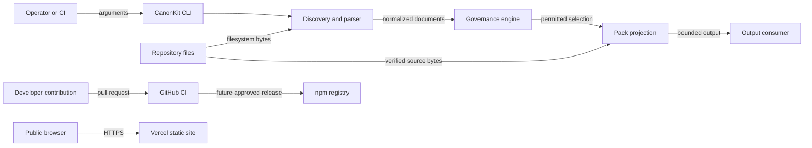

# CanonKit threat model

## Executive summary

CanonKit is a local, read-only TypeScript CLI and library that turns repository Markdown into governance reports, trust-graph projections, resolution results, and context packs. Its main security risks are not remote server compromise: they are a repository contributor manipulating governance metadata, sensitive pack output crossing into logs or external tools, untrusted document bodies influencing an AI consumer, hostile filesystem input exhausting a CI runner, and a future package release being confused with or compromised through the software supply chain. Repository, parser, aggregate-input, disclosure, provenance, output, and usage controls materially reduce risk. Three release blockers remain before the public alpha: npm scope authority, protected trusted publishing, and cross-platform exact-artifact evidence.

## Scope and assumptions

In scope:

- Runtime CLI and library code under `src/`
- Public schemas under `schema/`
- Runtime package boundary in `package.json` and `package-lock.json`
- GitHub CI in `.github/workflows/ci.yml`
- Static concept site in `public/index.html` and its Vercel deployment boundary
- Tests and fixtures only as evidence for controls, not as production runtime

Out of scope:

- Hosted APIs, accounts, authentication, databases, telemetry, model calls, MCP adapters, and IDE extensions, because none exists
- Security of Git, the host operating system, a downstream AI provider, or a consumer's CI platform beyond CanonKit's documented integration boundary
- Private project content and organisation-specific policy

Assumptions adopted after maintainer review:

- The alpha runs locally or in controlled CI against repositories the operator is authorised to read.
- Repositories may contain genuinely sensitive `internal` or `restricted` documents.
- Contributors may propose malicious Markdown or metadata through pull requests, but do not start with arbitrary code execution on the operator's machine.
- Untrusted or forked pull-request workflows must not create wider-audience packs, upload them as artifacts, or expose publishing credentials.
- The static website is informational only and processes no user-supplied data.
- The selected package candidate is `@vibelabz/canonkit`; the product and CLI command remain CanonKit and `canonkit`. Public package absence is not treated as scope ownership, which remains a release blocker until authenticated owner access, MFA, and recovery are verified.

Open questions that may change future rankings:

- Whether external users will feed packs directly into autonomous agents with write or execution privileges
- Which operating systems and CI providers will be supported beyond the current Ubuntu Node.js matrix
- The final npm organisation owner, recovery process, and required release approvers

## System model

### Primary components

- **CLI boundary:** `src/cli.ts`, `src/cli/arguments.ts`, and `src/cli/run.ts` accept process arguments, select a read-only command, and write results to standard output or errors to standard error.
- **Repository discovery and parsing:** `src/discovery/repository.ts`, `src/model/collection.ts`, and `src/metadata/frontmatter.ts` discover bounded Markdown, read strict UTF-8, parse constrained YAML, and validate versioned JSON Schema metadata.
- **Governance engine:** `src/policy/`, `src/graph/`, and `src/resolution/` evaluate explicit metadata and relationships without treating document bodies, filenames, or timestamps as authority.
- **Pack projection:** `src/pack/contract.ts`, `src/pack/projection.ts`, and `src/cli/pack-output.ts` enforce disclosure and size policies, revalidate selected source bytes, attach provenance, and render JSON or fenced Markdown.
- **Build and CI:** `package.json`, `package-lock.json`, and `.github/workflows/ci.yml` build and test the package on Node.js 22 and 24 with read-only repository permissions. No release workflow exists.
- **Static site:** `public/index.html` is deployed on Vercel and contains fixed HTML, CSS, and a small local script. It has no application backend or user-data flow.

### Data flows and trust boundaries

- **Operator → CLI:** arguments and repository path cross through `process.argv`; there is no authentication because execution authority comes from the local user or CI job. Native argument parsing, enums, integer limits, query length, and scope syntax validate the input (`src/cli/arguments.ts` / `parseCliArguments`).
- **Repository filesystem → discovery and parser:** filenames, links, bytes, YAML metadata, and Markdown bodies cross by local filesystem calls. Repository-root discovery, canonical path checks, symlink exclusion, strict UTF-8, file-count limits, per-file limits, YAML restrictions, and JSON Schema validation apply (`src/discovery/repository.ts` / `discoverMarkdownFiles`; `src/metadata/frontmatter.ts` / `parseMarkdownFrontmatter`).
- **Normalized documents → governance engine:** explicit identities, lifecycle, authority, visibility, subjects, and relationships cross in memory. Document and relationship policies validate conflicts before graph or pack use (`src/model/collection.ts` / `scanRepository`; `src/policy/`).
- **Selected repository sources → pack projection:** permitted paths and source bytes cross the disclosure boundary. Pack construction filters first, canonicalizes and rereads the source, reparses it, compares it with the normalized model, hashes exact bytes, and fails atomically (`src/pack/projection.ts` / `buildContextPack`).
- **CLI → output consumer:** reports or packs cross standard output into a terminal, file, CI log, artifact, or downstream tool chosen by the operator. CanonKit applies output limits and untrusted-content markers but cannot enforce the destination's confidentiality or behaviour (`src/cli/pack-output.ts`; `src/pack/projection.ts` / `renderContextPackMarkdown`).
- **Developer contribution → GitHub CI:** source and workflow changes cross through GitHub pull requests into `npm ci` and the quality gate. The current workflow has `contents: read`, no secrets, and no publishing authority (`.github/workflows/ci.yml`).
- **Future release approver → npm registry:** a reviewed commit, version, tarball, identity assertion, and provenance will cross through a future protected release workflow. This boundary does not exist yet and is blocked by `docs/ALPHA-RELEASE-BOUNDARY.md`.
- **Browser → Vercel static site:** an HTTPS request receives fixed public assets. Vercel currently supplies HSTS; no repository-configured CSP or clickjacking policy is visible. No sensitive or interactive data crosses this boundary (`public/index.html`).

#### Diagram

## Assets and security objectives

| Asset | Why it matters | Security objective (C/I/A) |
| --- | --- | --- |
| Repository document bodies | May contain private strategy, customer, security, or operational knowledge | C, I |
| Governance metadata and graph | Determines what CanonKit presents as current and authoritative | I |
| Context-pack selection and provenance | A downstream human or agent may rely on it for decisions or changes | I, C |
| Local filesystem boundary | Prevents unrelated host files from entering reports or packs | C, I |
| CLI availability and CI resources | Large hostile repositories must not exhaust normal developer or CI environments | A |
| Package name and release artifact | Users must install the intended code under the intended identity | I |
| npm and GitHub release authority | Compromise could distribute malicious code to every installer | C, I |
| Source, lockfile, workflows, and build output | Define the code and dependencies that become the package | I |

## Attacker model

### Capabilities

- Submit or persuade a maintainer to merge crafted Markdown, YAML metadata, filenames, relationships, and large collections.
- Influence a forked or untrusted pull request and observe public CI logs.
- Publish or promote a confusing package outside the intended npm scope.
- Place prompt-like instructions, long backtick sequences, misleading authority claims, or sensitive text inside repository documents.
- Race or mutate files when the attacker already has local filesystem write access concurrent with a CanonKit run.
- Compromise an upstream dependency, GitHub Action, maintainer account, or future release workflow if its protections are weak.

### Non-capabilities

- No network request reaches the CanonKit runtime; it has no listener, account, token, database, or remote command surface.
- A repository-only contributor cannot execute JavaScript through Markdown or YAML in the current parser.
- Document bodies cannot directly change normalized authority, lifecycle, visibility, ranking, or pack policy.
- The CLI cannot read files the operating-system user cannot read and is not intended to run with elevated privileges.
- The static site receives no user content and loads no third-party JavaScript.

## Entry points and attack surfaces

| Surface | How reached | Trust boundary | Notes | Evidence (repo path / symbol) |
| --- | --- | --- | --- | --- |
| CLI arguments | Local shell or CI command | Operator → CLI | Paths, formats, scopes, audiences, statuses, and limits | `src/cli/arguments.ts` / `parseCliArguments` |
| Repository traversal | Explicit start path | Filesystem → discovery | Repository root, nested repository, exclusion, and symlink handling | `src/discovery/repository.ts` / `discoverMarkdownFiles` |
| YAML frontmatter | Every eligible Markdown file | Repository bytes → parser | Strict parsing, no merges, aliases, or duplicate keys | `src/metadata/frontmatter.ts` / `parseMarkdownFrontmatter` |
| Public schemas | Parser-selected schema version | Metadata → normalized model | Limits shape and allowed governance values | `schema/` and `src/metadata/frontmatter.ts` / `compileSchema` |
| Governance metadata | Valid normalized documents | Contributor assertions → policy | Git access, not CanonKit, determines who may assert metadata | `src/policy/` and `src/graph/index.ts` |
| Resolution query | CLI argument | Operator → resolver | Bounded normalized string; used only for explicit metadata matching | `src/cli/arguments.ts` / `parseQuery`; `src/resolution/index.ts` |
| Pack audience and output | Explicit pack options and stdout | Repository → consumer | Public by default; wider disclosure is explicit but destination is uncontrolled | `src/pack/contract.ts`; `src/cli/run.ts` |
| Source revalidation | Pack construction | Filesystem → pack | Canonical path, reparse, comparison, SHA-256, atomic failure | `src/pack/projection.ts` / `buildContextPack` |
| Dependencies and CI actions | Install or CI execution | Registries/GitHub → build | Lockfile present; current CI is read-only; release controls absent | `package-lock.json`; `.github/workflows/ci.yml` |
| Static website | Public HTTPS request | Internet → Vercel | Fixed assets only; no untrusted DOM input or third-party script | `public/index.html` |

## Top abuse paths

1. **Promote malicious content:** a contributor changes a document to `canonical`, `active`, and `public` → repository review accepts it → CanonKit correctly treats the merged metadata as authoritative → a consumer relies on a false governing source.
2. **Disclose sensitive canon:** an operator or CI job selects `--audience restricted` → stdout is captured in a public log, artifact, clipboard, or external model request → sensitive repository bodies leave their intended boundary.
3. **Influence an agent:** a document body contains persuasive instructions → CanonKit marks and fences it but includes it as requested → a downstream agent ignores the trust marker → the agent performs an unsafe action with its own privileges.
4. **Exhaust CI:** an untrusted branch adds thousands of near-limit Markdown files → collection scanning retains large bodies before command-specific pack limits apply → memory or execution time exhausts the runner.
5. **Confuse package identity:** documentation or a user installs unscoped `canonkit` → npm resolves an unrelated package → the user runs code that is not this project.
6. **Compromise release:** a maintainer token, mutable CI action, or unprotected release job is compromised → an attacker publishes a malicious scoped version → downstream installers execute it.
7. **Race filesystem state:** a same-user local attacker swaps a selected path between canonicalization and read → CanonKit normally rejects model or byte differences → repeated failures deny a successful pack, with confidentiality impact limited by exact model comparison.
8. **Leak environment detail:** malformed paths or filesystem errors reach a public CI log → repository or runner path details are disclosed → an attacker gains low-value environment information.

## Threat model table

| Threat ID | Threat source | Prerequisites | Threat action | Impact | Impacted assets | Existing controls (evidence) | Gaps | Recommended mitigations | Detection ideas | Likelihood | Impact severity | Priority |
| --- | --- | --- | --- | --- | --- | --- | --- | --- | --- | --- | --- | --- |
| TM-001 | Malicious or mistaken repository contributor | Contributor can change governed Markdown and pass repository review | Assert false `canonical`, `active`, or `public` metadata so valid but unauthorised content governs | False authority or unintended public disclosure | Governance metadata, packs, repository bodies | Strict schema and deterministic policy (`schema/`, `src/policy/`); bodies do not confer authority | CanonKit cannot authenticate the human or approval behind metadata | State that Git review/ACL is the authority root; require protected branches and ownership review for governed paths; never describe metadata as cryptographic trust | Review alerts for visibility/authority changes; CI diff summary for governed metadata | Medium | High | high |
| TM-002 | Operator, workflow author, or compromised CI configuration | Process can read sensitive files and explicitly widens pack audience | Send internal/restricted output to public logs, artifacts, or external tools | Confidential repository content is exfiltrated | Document bodies, pack output | Public-only default, explicit cumulative audience, filtering before disclosure, atomic failures (`src/pack/contract.ts`, `src/pack/projection.ts`) | CanonKit cannot label or control stdout destinations after emission | Prohibit wider-audience packs in untrusted PR jobs; document safe redirection and retention; require trusted protected jobs for sensitive packs | CI policy scan for `--audience internal` or `restricted`; artifact/log review | Medium | High | high |
| TM-003 | Malicious document author | Consumer sends a requested pack to an AI agent with meaningful privileges | Embed instructions in a body that the downstream agent follows as commands | Agent changes code, leaks data, or performs external actions | Consumer environment, repository, credentials available to consumer | Body trust marker, separated metadata, body-specific Markdown fence, escaped JSON (`src/pack/projection.ts`) | A textual boundary is not a sandbox and cannot control downstream instruction hierarchy | Quick-start must require consumers to treat bodies as quoted evidence, not instructions; prohibit automatic privileged actions without separate policy and approval | Consumer-side tool-call audit and human approval logs | Medium | High | high |
| TM-004 | Malicious repository contributor | CanonKit scans an untrusted large branch in local or CI context | Add many large Markdown files to consume memory/time | CI or workstation denial of service | Availability, CI resources | Per-file 1 MiB, discovery 10,000-document, default 32 MiB aggregate, and hard 256 MiB aggregate limits; sequential bounded reads; atomic `CKS003_TOTAL_BYTES_EXCEEDED` failure (`src/model/collection.ts`, `src/discovery/repository.ts`) | An in-budget hostile repository can still consume normal bounded processing time | Retain aggregate and per-file limits; tune only from measured external usage; keep CI timeouts | Track budget diagnostics, run duration, and peak memory | Low | Medium | medium |
| TM-005 | Same-user local attacker or racing process | Attacker can modify filesystem paths during the scan/pack interval | Swap or mutate a selected source to cause stale or escaping input | Usually pack denial; confidentiality impact requires content also matching the validated model | Pack integrity and availability | Symlink exclusion, canonical root/path checks, reread, reparse, normalized comparison, digest, atomic failure (`src/discovery/repository.ts`, `src/pack/projection.ts`) | Filesystem operation is not a transactional snapshot | Document local same-user assumption; retain fail-closed checks; consider descriptor-based no-follow reads if later evidence justifies complexity | Count repeated `CKX005_SOURCE_INTEGRITY_ERROR` failures | Low | Medium | low |
| TM-006 | Compromised maintainer, dependency, GitHub Action, or publisher credential | A public release pipeline exists with write authority | Alter source/build or publish a malicious version under the intended package identity | Arbitrary code executes for downstream installers/users | Package artifact, release authority, downstream systems | Lockfile; current CI has `contents: read`, no secrets, and no publish step (`package-lock.json`, `.github/workflows/ci.yml`) | No authenticated `vibelabz` scope proof, protected trusted-publishing workflow, provenance gate, approval environment, or verified recovery policy exists | Verify organisation ownership and recovery; use npm trusted publishing/OIDC, provenance, protected environment approval, least permissions, immutable action SHAs, account MFA, exact tarball verification, and no routine local publish | npm/GitHub audit logs, provenance verification, release diff and install smoke test | Low before release; Medium after | High | high |
| TM-007 | Package-name squatter or user confusion | User follows ambiguous installation guidance | Install the unrelated unscoped `canonkit` package or publish under an unverified namespace | Execution of unintended third-party code, loss of project identity, or failed release | Users, package identity | Registry evidence and identity review reject unscoped `canonkit`; private metadata and docs use the selected `@vibelabz/canonkit`; publication remains disabled (`package.json`, `docs/PACKAGE-IDENTITY-REVIEW.md`) | The public package is absent but authenticated control of the `vibelabz` organisation is not yet proven | Verify owner access, MFA, and recovery before workflow work; publish only the exact approved scoped identity; never recommend unscoped installation or silently fall back to NarcoNations | Authenticated scope checklist, registry ownership check, and clean-environment install assertion | Medium until scope control; Low after | High | high |
| TM-008 | Public observer or opportunistic web attacker | Static site or public CI exposes low-sensitivity implementation detail | Read absolute diagnostic paths, frame the site, or exploit a future unsafe static-site change | Limited information exposure or UI deception | Public site, environment metadata | No user input or third-party scripts; Vercel HTTPS and HSTS; generic pack failures withhold hidden paths (`public/index.html`, `src/pack/projection.ts`) | Discovery errors may contain absolute paths; no repository-configured CSP, frame policy, or content-type policy | Keep sensitive jobs private; review diagnostic redaction before public CI examples; add static security headers during release rehearsal | Header regression check and log sampling | Low | Low | low |

## Criticality calibration

- **Critical:** a remotely reachable or release-path flaw that reliably executes attacker code for most installers, or publishes restricted repository bodies without operator opt-in. Examples: compromise of trusted publishing that replaces the alpha tarball; a parser path that executes Markdown as code; a public-default pack that includes restricted files.
- **High:** realistic compromise of governance integrity, sensitive output, consumer actions, or normal CI availability that needs an attacker-controlled repository change or release credential. Examples: false canonical promotion accepted without review; restricted pack output uploaded publicly; aggregate scan exhaustion; package-name confusion.
- **Medium:** partial disclosure, targeted denial, or supply-chain weakness with stronger prerequisites and bounded impact. Examples: repeated source-integrity races that only deny a pack; diagnostic paths in a private CI log becoming public; a future dependency alert not promptly triaged.
- **Low:** low-value information exposure or defense-in-depth gap without a path to sensitive runtime data. Examples: missing framing policy on the fixed static explainer; local path disclosure on a developer's own terminal; a failed symlink race that returns only a generic pack error.

## Focus paths for security review

| Path | Why it matters | Related Threat IDs |
| --- | --- | --- |
| `src/discovery/repository.ts` | Owns filesystem boundary, symlink policy, document count, and traversal behaviour | TM-004, TM-005, TM-008 |
| `src/model/collection.ts` | Enforces bounded file reads and the atomic aggregate repository-byte budget | TM-004 |
| `src/metadata/frontmatter.ts` | Parses attacker-controlled YAML and maps it into governance metadata | TM-001, TM-004 |
| `schema/` | Defines exactly which authority, lifecycle, visibility, and relationship claims are valid | TM-001 |
| `src/policy/` | Determines whether internally consistent but potentially malicious metadata passes governance checks | TM-001 |
| `src/graph/index.ts` | Applies visibility and scope eligibility before resolution output | TM-001, TM-002 |
| `src/pack/contract.ts` | Defines disclosure ceilings and pack budgets | TM-002, TM-003 |
| `src/pack/projection.ts` | Owns selection, source integrity, provenance, and untrusted-body serialization | TM-002, TM-003, TM-005 |
| `src/cli/run.ts` | Connects parsed policy to filesystem operations and uncontrolled stdout destinations | TM-002, TM-008 |
| `package.json` | Will define scoped identity, public access, runtime dependencies, and distributed files | TM-006, TM-007 |
| `.github/workflows/ci.yml` | Current supply-chain execution boundary and basis for a future protected release flow | TM-006 |
| `public/index.html` | Complete browser attack surface for the static site | TM-008 |

## Quality check

- [x] Covered every discovered CLI, filesystem, parser, policy, pack, output, CI, registry, and static-site entry point.
- [x] Represented every identified trust boundary in at least one threat.
- [x] Separated runtime behaviour from CI/build, release, tests, fixtures, and the static site.
- [x] Reflected the maintainer's inability to provide security-specific context by adopting and documenting conservative assumptions.
- [x] Recorded open questions and the assumptions that most affect risk.
- [x] Tied every High risk to an existing control and an explicit alpha blocker or required release control.
